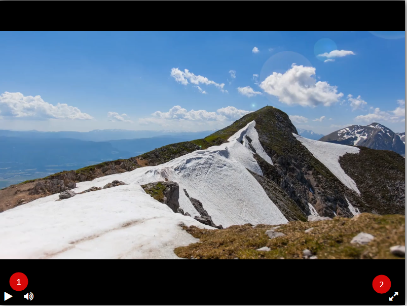

# Сайт с видеоплеером

Проект демонстрирует возможности библиотеки [Playable](https://wix.github.io/playable/)
Работающий сайт расположен по адресу [Player](https://rostwik.github.io/VideoPlayer/)





## Интерфейс плеера

1. блок кнопок отвечает за воспроизведение и включение, либо выключение звука
2. кнопка позволяет развернуть изображение в полный экран

## Как подключить библиотеку
JS код поставляется в виде одного файла player.js, который нужно скачать из этого репозитория. Для работы он требует двух библиотек - jQuery и Playable. Пример подключения в браузере:

```html
<script src="https://code.jquery.com/jquery-3.4.1.min.js"></script>
<script src="https://unpkg.com/playable@2.10.3/dist/statics/playable.bundle.min.js"></script>
<script src="player.js"></script>
```

Для работы библиотека требует HTML разметки. Вот полный пример с минимальным количеством настроек:

```html
<div id="player" style="width: 800px; height: 600px;">
  <div class="js-video-container" style="width: 100%; height: 100%"></div>
</div>

<script src="https://code.jquery.com/jquery-3.4.1.min.js"></script>
<script src="https://unpkg.com/playable@2.10.3/dist/statics/playable.bundle.min.js"></script>
<script src="player.js"></script>

<script type="text/javascript">
  createPlayer({elementId: 'player'});
</script>
```
# Автор

* **Rostislav** - [Rostislav](https://github.com/Rostwik)

Код написан в учебных целях - это урок в курсе по Python и веб-разработке на сайте [Devman](https://dvmn.org)